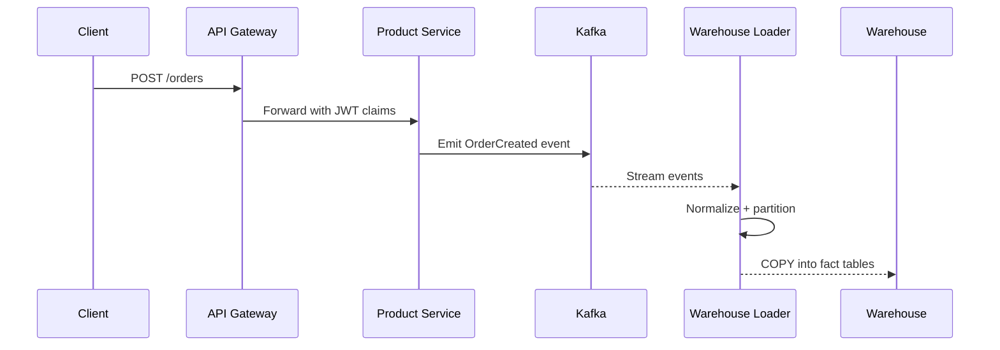

# Data Flow (API to Warehouse)

## Sequence


## Event contract
```json
{
  "event": "order.created",
  "version": 3,
  "occurred_at": "2026-01-03T10:00:00Z",
  "order_id": "ord_123",
  "tenant": "acme",
  "user_id": "usr_42",
  "total": 123.45,
  "currency": "USD"
}
```
- Schema registry enforces `version` via compatibility mode (BACKWARD).
- Producers publish to `orders.v3`; consumers must handle replay.

## Ingestion rules
- Warehouse partitions by `occurred_at` day and `tenant`.
- Late events (<24h) accepted; older require manual backfill.
- PII is hashed before landing zone; raw copies in cold storage for 30 days.

## Data quality checks
- Row counts vs source every 15 min
- Primary key uniqueness on `order_id + tenant`
- Freshness alert if delay > 5 min
