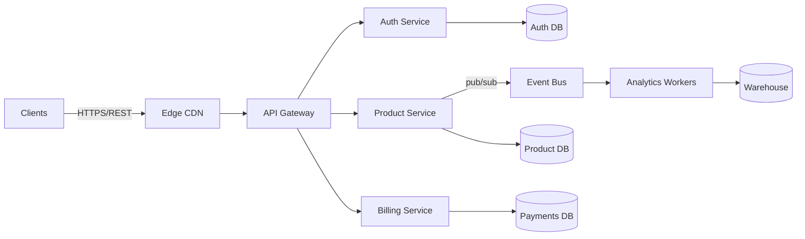

# Platform Architecture Overview

## At-a-glance
- Audience: engineers, SRE, product
- Scope: runtime topology, data domains, key SLIs/SLOs
- Related docs: [Data Flow](../architecture/data-flow.md), [Auth API](../api/auth.md)

## Diagram

## Runtime topology
- Tenants: single-tenant per environment (dev, staging, prod)
- Traffic: HTTPS only, HSTS enabled, TLS 1.2+
- Deploys: rolling via blue/green; per-service Helm charts
- State: Postgres for OLTP, S3 for blobs, Redis for cache, Kafka for events

## Availability targets
| SLI | SLO | Notes |
| --- | --- | ----- |
| p99 latency | < 300ms | steady-state, GET only |
| error rate | < 0.1% | 5xx + gateway 429 |
| uptime | 99.9% monthly | excludes planned maint |

## Decisions (abridged)
- API Gateway handles cross-cutting concerns (authN/Z, rate limits, headers)
- Event-driven between product and billing to decouple payment provider latency
- Warehouse fed from Kafka; schema registry enforces contracts

## Open questions
- Should we move Redis to managed tier?
- Evaluate gRPC for internal calls once service mesh is stable.
