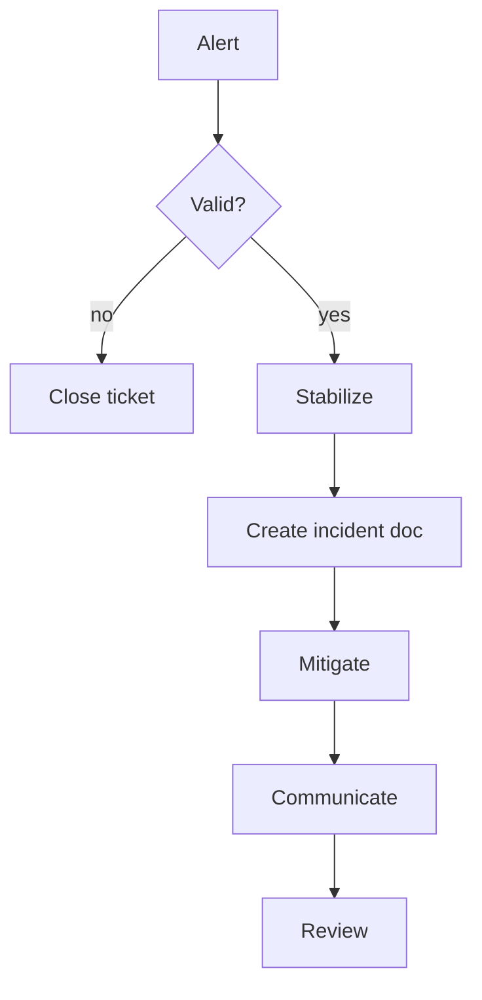

# On-call Runbook

## Pager policy
- Severity 1: page primary + secondary, target ack < 5 min
- Severity 2: page primary, ack < 15 min
- Severity 3: email only, ack < 1h

## Triage flow


## Checklists
- Validate alert: correlate dashboards, check recent deploys
- Contain blast radius: toggle feature flag, rate-limit, or drain nodes
- Restore service: roll back, restart pods, clear stuck jobs
- Communicate: status page every 30 min, Slack #incident, customer updates hourly

## Handy commands
```bash
# tail app logs
kubectl logs deploy/api -n prod --tail=200

# check error rate SLI
kubectl exec -n prod deploy/api -- curl -s http://localhost:9000/metrics | grep http_request_errors_total
```

## Aftermath
- Fill [incident template](../ops/incident-template.md)
- File follow-up tickets within 24h
- Schedule postmortem if Sev1/Sev2
