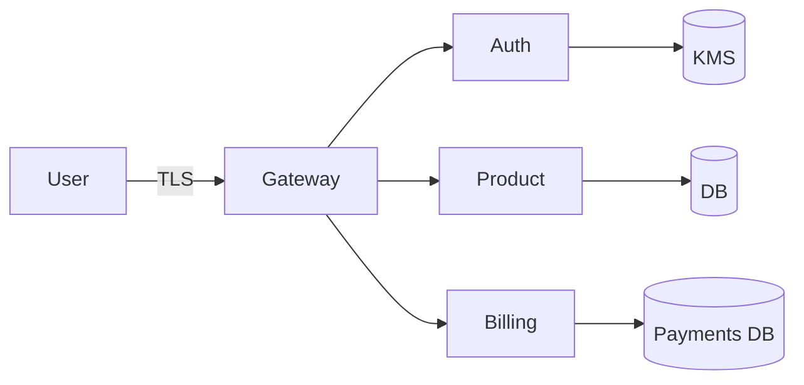

# Threat Model

## Scope
- Auth, Payments, Product services
- External actors: end-users, attackers, compromised admin

## Data classification
| Class | Examples | Controls |
| --- | --- | --- |
| Public | docs, status page | CDN cache, HSTS |
| Confidential | user profiles, orders | TLS, RBAC, audit logs |
| Secret | tokens, keys | KMS, short TTL, envelope encryption |

## DFD

## STRIDE summary
- Spoofing: JWT signing keys in KMS; rotated quarterly
- Tampering: HMAC for webhooks; integrity checks on artifacts
- Repudiation: Audit logs for admin actions; WORM storage 90d
- Information disclosure: TLS 1.2+, secrets in env only, no logs of PII
- Denial of service: rate limits per tenant; autoscaling; circuit breakers
- Elevation: RBAC + ABAC; least-privileged IAM for services

## Open issues
- Evaluate mTLS between services
- Add chaos tests for rate-limit bypass
