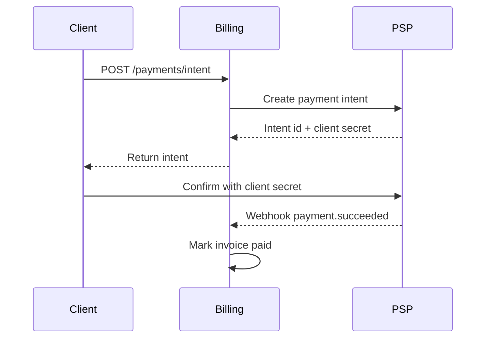

# Payments API

## Endpoints
- POST /v1/payments/intent
- POST /v1/payments/confirm
- GET /v1/payments/{id}

## Sequence


## Request/response
```http
POST /v1/payments/intent
Content-Type: application/json

{ "amount": 2599, "currency": "USD", "customer_id": "cus_123" }
```
Response
```json
{ "id": "pay_abc", "client_secret": "sek_test", "status": "requires_confirmation" }
```

## Webhooks
- `payment.succeeded`
- `payment.failed`
- `payment.refunded`

Verify with HMAC header `X-Signature` using shared secret per-tenant.

## SLAs
| Metric | Target |
| --- | --- |
| p95 intent create | < 400ms |
| p95 confirm | < 600ms |
| webhook delivery | < 5s |

## Notes
- Idempotency keys required on intent create
- PCI scope avoided via hosted fields
- Retries: exponential backoff (100ms base, 5 tries)
